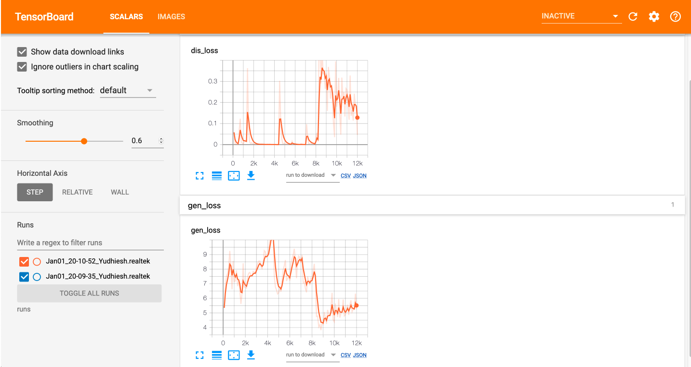

# AgriNet

[](https://github.com/ULAS-HiPR/AI-utils/actions/workflows/agrinet.yml)

A RGB to NIR image translation model for agricultural aerial evaluation on vegetation and moisture data.

## Datasets

nirscene0 - 477 images
multiple scenes ranging in conditions, this was used as it is a good balance for generalisation.

## Tools

### Training

CLI tool available via `python train.py --help` for more information.

```man
usage: train.py [-h] --name NAME --data_dir DATA_DIR --batch_size BATCH_SIZE
                --epochs EPOCHS [--lr LR] [--ext EXT] [--seed SEED]

optional arguments:
  -h, --help            show this help message and exit
  --name NAME           Name of experiment, used for logging and saving
                        checkpoints and weights in one directory
  --data_dir DATA_DIR   Path to data directory. must contain train and test
                        folders with images (see --ext)
  --batch_size BATCH_SIZE
                        Batch size for training
  --epochs EPOCHS       Number of epochs to train
  --lr LR               Learning rate for training
  --ext EXT             Extension of the images
  --seed SEED           Random seed for training
```

### Tensorboard

For monitoring loss during training and viewing input and output space

```bash
agrinet $ tensorboard --logdir={NAME}/logs
```

**Example view**



### Model evaluation

CLI tool available via `python test.py --help` for more information.

```man
usage: test.py [-h] --exp EXP [--data_dir DATA_DIR] [--ext EXT] [--batch_size BATCH_SIZE] [--save SAVE]

optional arguments:
  -h, --help            show this help message and exit
  --exp EXP             Experiment name
  --data_dir DATA_DIR   Path to the data
  --ext EXT             Extension of the images
  --batch_size BATCH_SIZE
                        Batch size
  --save SAVE           Save results to file
```

### Unit tests
  
  ```bash
  agrinet $ python -m unittest discover -q tests
  ```
